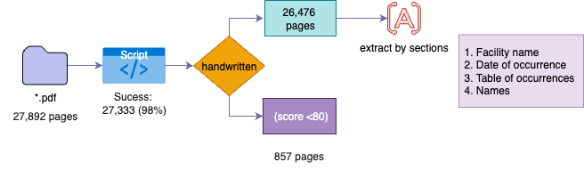

```{python}
#| echo: false
#| include: false
#| warning: false
import polars as pl
import altair as alt
from pathlib import Path
import matplotlib.pyplot as plt
from PIL import Image
import json
alt.data_transformers.enable("vegafusion")
root = Path('..')
parquet_path = root / 'data/jails-data/output/jails_pdfs.parquet'
df = pl.read_parquet(parquet_path)

df_cleaned = 
```

## Outline: {.smaller}

1. **Overview and methodology**
2. **Improvements**
3. **Occurrences summary**
4. **Breakdown** 
   - Facilities and occurrences
5. **Case Study**
6. **Next steps and feedback**

---

## Overview {.smaller}

-  Questions to solve :


---

## Summary {.smaller}


- Total pages: 27,892
- Automated processing pipeline
- Handwritten analysis: 857
- Extraction OCR and cleaning
- Resulting deaths: 137

::: {.columns .fragment}
::: {.column width="70%"} 
{width=100%}
:::

::: {.column width="30%"}
{width=100%}
:::
:::


---

## Improvements {.smaller}

```{python}
#| echo: false
#| include: false
#| warning: false

```

- Adjusted OCR regions to table of occurences

:::{.incremental}
| Field                 | Total | Missing |     % |
|-----------------------|-------|---------|-----------------|
| Cleaned Facility Name | 27,333 | 2,239    | 8.19       |
| Cleaned Date | 27,333 | 5,431    | 19.86      |
| Occurrences  | 27,333 | 3,418    | 12.5     |
:::

---


## Statistics {.smaller}

Most common by facility name

```{python}
#| echo: false
#| code-fold: true
#| code-summary: "Show Python code"
top_facilities = (
    df_cleaned
    .filter(pl.col('Cleaned Facility Name').is_not_null())  # Remove null facility names
    .group_by('Cleaned Facility Name')
    .len()
    .sort('len', descending=True)
    .head(20)
    .rename({'len': 'Case Count'})
)

# Create the Altair chart
facilities_chart = alt.Chart(top_facilities).mark_bar().encode(
    x=alt.X('Case Count:Q', title='Number of Cases'),
    y=alt.Y('Cleaned Facility Name:N', sort='-x', title='Facility Name'),
    color=alt.value("#da746d"), 
    tooltip=[
        'Cleaned Facility Name:N', 
        alt.Tooltip('Case Count:Q', format=',d')
    ]
).properties(
    width=600,
    height=400,
    title='Top 20 Facilities by Number of Cases'
)

facilities_chart
```


---

## Occurrences summary{.smaller}


{width=100%}


---

## Occurrences summary{.smaller}

{width=100%}

--- 

## Breakdown{.smaller}

Cook county

{width=100%}

---

## Breakdown{.smaller}

Kane county

{width=100%}

---

## Breakdown{.smaller}

Madison

{width=100%}

---

## Breakdown{.smaller}

Restrains usage among jails

::: {.columns .fragment}
::: {.column width="50%"} 

:::
::: {.column width="50%"} 

:::
:::

---

## Breakdown{.smaller}

Fighting


---

## Case Study

Case study with Robert Ordonez. Here's some facts:

:::{.incremental}
- Subject to 50 Occurrence Reports from March 12th, 2021 to August 7th, 2022
- Imprisoned in Kane County
- Was placed in a restraints or a restraint chair 41 times, making up 6% of all of Kane County's restraints usage
- OC Spray used 4 times, "Taser Display" 3 times
- "Charges Filed" 4 times
- Injured once in restraints with "Abrasions right arm & fingers"
:::