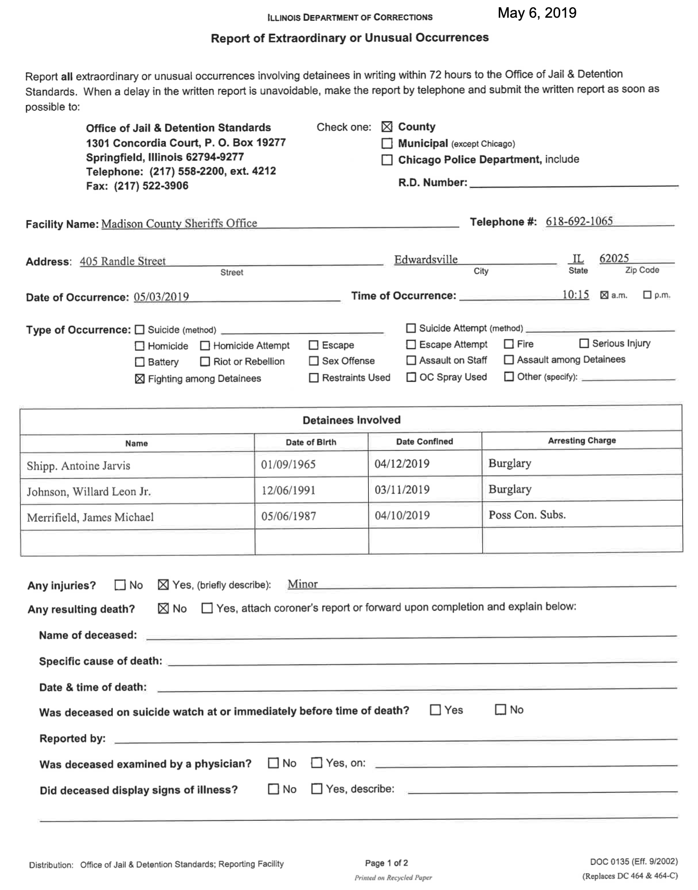
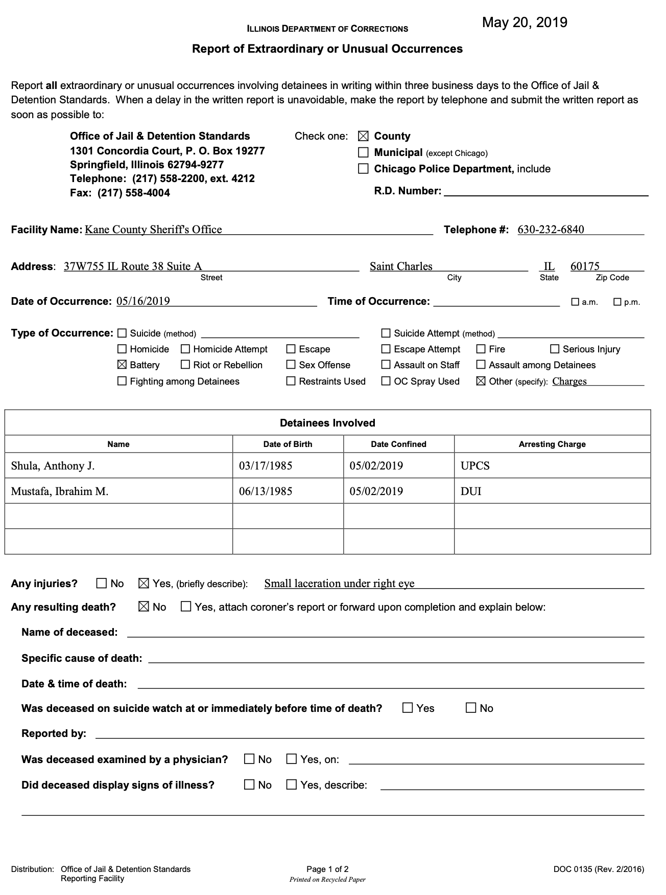
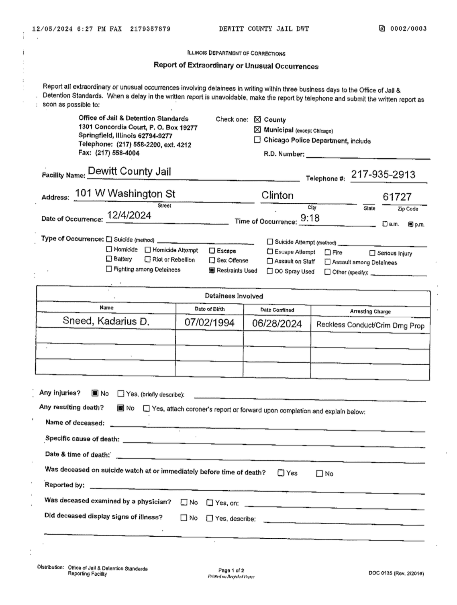
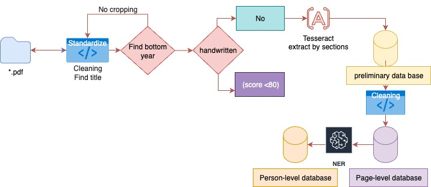

```{python}
#| echo: false
#| include: false
#| warning: false
import polars as pl
import altair as alt
from pathlib import Path
import matplotlib.pyplot as plt
from PIL import Image
import json
alt.data_transformers.enable("vegafusion")

root = Path('../..')
#parquet_path = root / 'data/jails-data/SERVER/run 0728/output/jails_pdfs_cleanned.parquet'
parquet_path = root / 'data/jails-data/final files/output/jails_pdfs_cleanned.parquet'
print(parquet_path)
df_cleaned = pl.read_parquet(parquet_path)
#parquet_normal = root / 'data/jails-data/SERVER/run 0728/output/jails_pdfs_full.parquet'
parquet_normal = root / 'data/jails-data/final files/output/jails_pdfs_full.parquet'
df_normal = pl.read_parquet(parquet_normal)

df_cleaned= df_cleaned.with_columns(
    pl.when(pl.col("Cleaned Facility Name").str.contains("Peoria"))
    .then(pl.lit("Peoria County Jail"))
    .when(pl.col("Cleaned Facility Name").str.contains("Adams"))
    .then(pl.lit("Adams County Jail"))
    .when(pl.col("Cleaned Facility Name").str.contains("Dupage"))
    .then(pl.lit("Dupage County Jail"))
    .when(pl.col("Cleaned Facility Name").str.contains("Kane"))
    .then(pl.lit("Kane County Jail"))
    .when(pl.col("Cleaned Facility Name").str.contains("Lake County"))
    .then(pl.lit("Lake County Jail"))
    .when(pl.col("Cleaned Facility Name").str.contains("Sangamon"))
    .then(pl.lit("Sangamon County Jail"))
    .when(pl.col("Cleaned Facility Name").str.contains("Vill County"))
    .then(pl.lit("Will County Jail"))
    .when(pl.col("Cleaned Facility Name").str.contains("Williamson"))
    .then(pl.lit("Williamson County Jail"))
    .when(pl.col("Cleaned Facility Name").str.contains("Winnebago"))
    .then(pl.lit("Williamson County Jail"))
    .otherwise(pl.col("Cleaned Facility Name"))
    .alias("Cleaned Facility Name")
)

parquet_path_persons = root / 'data/jails-data/final files/output/jails_person_records.parquet'
df = pl.read_parquet(parquet_path_persons)
df_cleaned_p = df.with_columns(
    pl.col("Name")
    .str.replace_all(r"[;|_\-!~\"“”]", "")  # Remove ; | _ - ! ~ " “ ”
    .str.strip_chars()
    .alias("Cleaned Name")
)

```

## Outline: {.smaller}

1. **Overview**
    - **The challenge**
    - **Methodology and solution** 
2. **Overall statistics**
3. **Findings**
4. **Deliverables**
5. **Possible future extensions**

---

## Overview {.smaller}

- All jails in Illinois: required to submit reports of unusual occurences [Section 701.30] (County, Municipal, Police Departments)
- Unusual occurrences include: restraints, suicide attempts, sexual assault, battery, deaths, etc.
- After FOIA requests, we have 299 PDFs, with different amount of reports each (pages).
    - **27,892 pages in total**
    - Different time coverage
    - Only the first page of the reports was largely available
    - Extra pages include testimony, write-ups and suggestions (not available for many)
    - Some of the reports are handwritten
- Examples 

---

##### **Examples of *good* reports** {.smaller}

::: {.columns}
::: {.column width="50%"} 

:::

::: {.column width="50%"}

:::
:::

---

## **Questions**

- Can we systematically extract the information on the PDFs into an structured database?
- What patterns in the extracted data can be identified?
- What is the frequency of occurrences throughout Illinois Jails?

:::{.callout .fragment}
This project aims to extract, clean, and analyze reports of unusual occurrences from Illinois county jails. The project leverages OCR and data processing to transform scanned PDF reports into structured data, enabling statistical analysis and insights into jail events across the state. This can help with jail oversight and accountability.
:::

---

## Challenges {.smaller}

::: {.columns}
::: {.column width="60%"}
- Varying quality: Badly scanned, rotated or skewed pages  
    - Content identification and standardization needed  
- Handwritten reports  
    - Identify them to differentiate the extraction process  
- Different form types: 2002, 2016, 2024, and Cook County  
    - Implies different coordinates for ROI definition  
    - Cook County large tables  
- Variation in how reports were filled out  
- Name identification in table of contents  
    - Create a person-level database  
:::

::: {.column width="40%"}

<details>
  <summary><b>Death box example</b></summary>
  
</details>

<details>
  <summary><b>Handwritten example</b></summary>
  
</details>

<details>
  <summary><b>Bad scan example</b></summary>
  
</details>

<details>
  <summary><b>Cook County table</b></summary>
  
</details>

:::
:::

---

## Solutions {.smaller .scrollable}

- Handwritten flagged with OCR confidence score

```{python}
#| echo: false
#| include: true
ocr_histogram = alt.Chart(df_normal).mark_bar().encode(
    x=alt.X('OCR_Confidence:Q', 
            bin=alt.Bin(maxbins=30),
            title='OCR Confidence Score',
            scale = alt.Scale(domain=[46,100])
    ),
    y=alt.Y('count():Q', 
            title='Number of Documents'),
    color=alt.value("#E0AC3BA6"),
    tooltip=[
        alt.Tooltip('OCR_Confidence:Q', bin=True, title='OCR Confidence Range'),
        alt.Tooltip('count():Q', title='Document Count')
    ]
    ).properties(
    width=600,
    height=400,
    title='Distribution of OCR Confidence Scores')

vertical_line = alt.Chart(df_normal).mark_rule(
    color='red',
    strokeWidth=2,
    strokeDash=[5, 5]
    ).encode(
    x=alt.X('OCR_Confidence:Q', scale=alt.Scale(domain=[46, 100]))
    ).transform_calculate(
    OCR_Confidence='80'
    )
ocr_histogram_with_line = ocr_histogram + vertical_line
ocr_histogram_with_line
```

- Standardize layouts: fixed distance from top and bottom
- Convert PDFs to images, scan text
- Data pipeline
{.fragment width="100%"}
- Hardcoding coordinates depending on form type
- LLM to identify persons and names [runs local on Mansueto's computer]

---

## Summary Statistics {.smaller}

```{python}
#| echo: false
#| include: true
total_pages_threshold = df_normal.filter(pl.col('OCR_Confidence') < 80).height
total_pages_threshold = f"{total_pages_threshold:,}"
```
- Total pages: 27,892
    - 98 % succeed being a report (have title) → `{python} f"{df_cleaned.height:,}"`
    - 2 % without this words on the title `Extraordinary | Unusual |Occurence`

- From the handwritten analysis: `{python} total_pages_threshold`
- Confirmed deaths: 78

---

## Summary Statistics {.smaller}

```{python}
#| echo: false
#| include: false
def print_missing_stats(df, fields):
    stats = []
    total = df.height
    for field in fields:
        missing = df.select(pl.col(field).is_null().sum()).item()
        stats.append({
            "Field": field,
            "Total": total,
            "Missing": missing,
            "Missing_Percent": (missing / total) * 100
        })
    stats_df = pl.DataFrame(stats)
    print("## Missing Data Completeness\n")
    with pl.Config(
        tbl_formatting="MARKDOWN",
        tbl_hide_column_data_types=True,
        tbl_hide_dataframe_shape=True,
    ):
        print(stats_df.select(['Field', 'Total', 'Missing', 'Missing_Percent']))

# Example usage:
fields = ['Cleaned Facility Name', 'Cleaned Date', 'Cleaned Occurrences', 'Cleaned Address', 'Zip Code', 'RD Number', 'Resulting Death?']
print_missing_stats(df_cleaned, fields)
```

- Percentage missing extraction stats after cleaning and implementing alternative pipeline

| Field                 | Total | Missing | Missing Percentage |
|-----------------------|-------|---------|-----------------|
| Cleaned Facility Name | 26909 | 824     | 3.06        |
| Cleaned Date          | 26909 | 2767    | 10.28       |
| Cleaned Occurrences   | 26909 | 683     | 2.53       |
| Cleaned Address       | 26909 | 1       | 0.0037        |
| Zip Code              | 26909 | 1140    | 4.23        |
| RD Number             | 26909 | 0       | 0.0             |
| Resulting Death?      | 26909 | 0       | 0.0             |

---

## Common Facilities {.smaller}

```{python}
top_facilities = (
    df_cleaned
    .filter(pl.col('Cleaned Facility Name').is_not_null())  # Remove null facility names
    .group_by('Cleaned Facility Name')
    .len()
    .sort('len', descending=True)
    .head(20)
    .rename({'len': 'Case Count'})
)

# Create the Altair chart
facilities_chart = alt.Chart(top_facilities).mark_bar().encode(
    x=alt.X('Case Count:Q', title='Number of Cases'),
    y=alt.Y('Cleaned Facility Name:N', sort='-x', title='Facility Name'),
    color=alt.value("#da746d"), 
    tooltip=[
        'Cleaned Facility Name:N', 
        alt.Tooltip('Case Count:Q', format=',d')
    ]
).properties(
    width=600,
    height=400,
    title='Top 20 Facilities by Number of Cases'
)

facilities_chart
```


---

## Time trend in reports {.smaller}

```{python}
#| echo: false
#| include: true
time_series_data = (
    df_cleaned
    .filter(pl.col('Cleaned Date').is_not_null())  # Remove null dates
    .with_columns(
        pl.col('Cleaned Date').str.to_date("%m/%d/%Y").alias('Date_parsed')  # Convert to actual date
    )
    .filter(pl.col('Date_parsed').dt.year().is_between(2018, 2024)) 
    .with_columns(
        pl.col('Date_parsed').dt.truncate('1mo').alias('Month')
    )
    .group_by('Month')
    .len()
    .sort('Month')
    .rename({'len': 'Case Count'})
)

# Create the time series chart
time_series_chart = alt.Chart(time_series_data).mark_line(
    point=True,
    strokeWidth=2
).encode(
    x=alt.X('Month:T', 
            title='Date of Occurrence',
            axis=alt.Axis(format='%b %Y')  # Format as "Jan 2021"
    ),
    y=alt.Y('Case Count:Q', 
            title='Number of Cases'
    ),
    color=alt.value("#50a0d9"),
    tooltip=[
        alt.Tooltip('Month:T', format='%B %d, %Y', title='Date'),
        alt.Tooltip('Case Count:Q', title='Cases')
    ]
).properties(
    width=700,
    height=400,
    title='Cases Over Time - Date of Occurrence'
)

time_series_chart
```

---

## Occurrence Statistics {.smaller}

```{python}
#| echo: false
#| include: true
total_occurrence_result = (
    df_cleaned
    .with_columns(
        pl.col("Cleaned Occurrences").str.split("; ").alias("Cleaned Occurrences")
    )
    .explode("Cleaned Occurrences")
    .filter(pl.col("Cleaned Occurrences").is_not_null())
    .select(
        pl.col("Cleaned Occurrences").value_counts(sort=True)
    )
    .unnest("Cleaned Occurrences")
    .head(12)
)

total_occurrence_result = total_occurrence_result.filter(~pl.col("Cleaned Occurrences").is_in(["Error, no occurrence found"]))

total_occurrence_chart = alt.Chart(total_occurrence_result).mark_bar().encode(
    x=alt.X("count:Q", title="Count"),
    y=alt.Y("Cleaned Occurrences:N", title="Occurrence",).sort('-x')
).properties(
    title="Most Common Occurrences Across All Jails"
)

total_occurrence_chart = alt.Chart(total_occurrence_result).mark_bar(
    color="#E0AC3BA6"
).encode(
    x=alt.X('count:Q', title='Number of Cases'),
    y=alt.Y('Cleaned Occurrences:N', sort='-x', title='Occurrence'),
    tooltip=[
        alt.Tooltip('Cleaned Occurrences:N', title='Occurrence'),
        alt.Tooltip('count:Q', format=',d', title='Case Count')
    ]
).properties(
    width=600,
    height=400,
    title='Most Common Occurrences Across All Jails'
)

# Footnote as a separate text chart (keep your note)
footnote = alt.Chart(pl.DataFrame({
    "text": ["Note: Occurrences may be concurrent. Missing 2,027 Occurrences (7.3%)"],
    "x": [0],
    "y": [0]
})).mark_text(
    align="left",
    baseline="bottom",
    fontSize=10,
    dx=0,
    dy=20,
    color="gray"
).encode(
    x=alt.value(-50),
    y=alt.value(440),
    text="text:N"
)

# Layer chart and footnote, remove box
total_occurrence_chart = alt.layer(
    total_occurrence_chart,
    footnote
).configure_view(
    stroke=None
)
total_occurrence_chart
```

---

## Occurrence Statistics {.smaller}

```{python}
#| echo: false
#| include: true
top_counties = (
    df_cleaned
    .select(["Cleaned Facility Name", "Cleaned Occurrences"])
    .with_columns(
        pl.col("Cleaned Occurrences").str.split(";").alias("Cleaned Occurrences")
    )
    .explode("Cleaned Occurrences")
    .with_columns(
        pl.col("Cleaned Occurrences").str.strip_chars().alias("Cleaned Occurrences")
    )
    .filter(pl.col("Cleaned Occurrences").is_not_null())
)

total_reports = (
    top_counties
    .group_by("Cleaned Facility Name")
    .agg(pl.len().alias("total_reports"))
)

def get_county_occurrences(current_jail):
    filtered_df = top_counties.filter(pl.col("Cleaned Facility Name") == current_jail)
    current_jail_result = (
    filtered_df.select(
        pl.col("Cleaned Occurrences").value_counts(sort=True)
    )
    .unnest("Cleaned Occurrences")
    .head(12)
    )
    current_jail_result = current_jail_result.filter(~pl.col("Cleaned Occurrences").is_in(["Error", "no occurrence found"]))
    current_jail_chart = alt.Chart(current_jail_result).mark_bar(
    color="#54728d").encode(
    x=alt.X('count:Q', title='Number of Cases'),
    y=alt.Y('Cleaned Occurrences:N', sort='-x', title='Occurrence'),
    tooltip=[
        alt.Tooltip('Cleaned Occurrences:N', title='Occurrence'),
        alt.Tooltip('count:Q', format=',d', title='Case Count')
    ]
    ).properties(
    width=600,
    height=400,
    title=current_jail
    )
    return current_jail_chart

def get_county_occurrences_percent(current_jail):
    filtered_df = top_counties.filter(pl.col("Cleaned Facility Name") == current_jail)
    current_jail_result = (
        filtered_df.select(
            pl.col("Cleaned Occurrences").value_counts(sort=True)
        )
        .unnest("Cleaned Occurrences")
        .filter(~pl.col("Cleaned Occurrences").is_in(["Error", "no occurrence found"]))
    )
    total_count = current_jail_result["count"].sum()
    current_jail_result = current_jail_result.with_columns(
        (pl.col("count") / total_count * 100).alias("percentage")
    )
    current_jail_result = current_jail_result.sort("count", descending=True).head(10)
    current_jail_chart = alt.Chart(current_jail_result).mark_bar(
    color="#54728d").encode(
    x=alt.X('count:Q', title='Number of Cases'),
    y=alt.Y('Cleaned Occurrences:N', sort='-x', title='Occurrence'),
    tooltip=[
        alt.Tooltip('Cleaned Occurrences:N', title='Occurrence'),
        alt.Tooltip('count:Q', format=',d', title='Case Count')
    ]
    ).properties(
    width=600,
    height=400,
    title=current_jail
    )

    return current_jail_chart
get_county_occurrences("Cook County Department Of Corrections")
```

--- 

## Occurrence Statistics {.smaller}

```{python}
#| echo: false
#| include: true

get_county_occurrences("Kane County Jail")

```

---

## Occurrence Statistics {.smaller}
```{python}
#| echo: false
#| include: true

get_county_occurrences("Madison County Sheriffs Office")

```


---

## Occurrence Statistics {.smaller}

```{python}
#| echo: false
#| include: true

get_county_occurrences("Lake County Jail")

```

---

## Occurrence Statistics {.smaller}

```{python}
#| echo: false
#| include: true

get_county_occurrences("Peoria County Jail")

```

---

## Use of restraints {.smaller}


```{python}
#| echo: false
#| include: true
pattern = r"\bRestraints\b"

restraints_table = df_cleaned.filter(
    pl.col("Cleaned Occurrences").str.contains(pattern)
)

restraints_table = (
    restraints_table.select(
        pl.col("Cleaned Facility Name").value_counts(sort=True)
    )
    .unnest("Cleaned Facility Name")
    .head(21)
)

restraints_table = restraints_table.filter(pl.col("Cleaned Facility Name") != "")

restraints_chart = alt.Chart(restraints_table).mark_bar(
    color="#5a8664").encode(
    x=alt.X("count:Q", title="Count"),
    y=alt.Y("Cleaned Facility Name:N", title="Jail").sort('-x'),
    tooltip=[
        alt.Tooltip("Cleaned Facility Name:N", title="Jail"),
        alt.Tooltip("count:Q", format=",d", title="Case Count")
    ]
).properties(
    width=600,
    height=400,
    title="Top Jails for Restraint Usage"
)

# Footnote as a separate text chart
footnote = alt.Chart(pl.DataFrame({
    "text": ["Note: Missing 1,119 County Names (4.33%)"],
    "x": [0],
    "y": [0]
})).mark_text(
    align="left",
    baseline="bottom",
    fontSize=10,
    dx=0,
    dy=20,  # distance below the main chart area
    color="gray"
).encode(
    x=alt.value(0),
    y=alt.value(440),  # just below the chart (chart height + some offset)
    text="text:N"
)

# Use layering to draw the footnote over/under the chart
restraints_chart = alt.layer(
    restraints_chart,
    footnote
).configure_view(
    stroke=None  # removes box around the chart
)
restraints_chart
```

---

## Use of restraints {.smaller}

```{python}
#| echo: false
#| include: true

restraints_table = restraints_table.filter(
    pl.col("Cleaned Facility Name") != "null"
).join(total_reports, on="Cleaned Facility Name")

restraints_per_jail = (
    top_counties
    .filter(pl.col("Cleaned Occurrences") == "Restraints Used")
    .group_by("Cleaned Facility Name")
    .agg(pl.len().alias("restraint_count"))
)

merged = (
    restraints_per_jail
    .join(total_reports, on="Cleaned Facility Name")
    .with_columns(
        (pl.col("restraint_count") / pl.col("total_reports") * 100).alias("perc")
    )
    .filter(pl.col("total_reports") >= 100)
)

restraints_perc_chart = alt.Chart(merged.to_pandas()).mark_bar(
    color='#E74C3C99'
).encode(
    x=alt.X("perc:Q", title="Percentage"),
    y=alt.Y("Cleaned Facility Name:N", title="Jail").sort('-x')
).properties(
    width=600,
    height=400,
    title="Top Jails for Restraint Usage as a Percent of Reports"
)

# Footnote as a separate text chart
footnote = alt.Chart(pl.DataFrame({
    "text": ["Note: Only Jails with over 100 Reports Total"],
    "x": [0],
    "y": [0]
})).mark_text(
    align="left",
    baseline="bottom",
    fontSize=10,
    dx=0,
    dy=20,  # distance below the main chart area
    color="gray"
).encode(
    x=alt.value(0),
    y=alt.value(440),  # just below the chart (chart height + some offset)
    text="text:N"
)

# Use layering to draw the footnote over/under the chart
restraints_perc_chart = alt.layer(
    restraints_perc_chart,
    footnote
).configure_view(
    stroke=None  # removes box around the chart
)
restraints_perc_chart
```

---


## Use of restraints {.smaller}

```{python}
#| echo: false
#| include: true


pattern = r"\bSuicide\b"

suicide_table = top_counties.filter(
    pl.col("Cleaned Occurrences").str.contains(pattern)
)

suicide_table = (
    suicide_table.select(
        pl.col("Cleaned Facility Name").value_counts(sort=True)
    )
    .unnest("Cleaned Facility Name")
    .head(11)
)

suicide_table_table = suicide_table.filter(pl.col("Cleaned Facility Name") != "")

suicide_chart = alt.Chart(suicide_table).mark_bar().encode(
    x=alt.X("count:Q", title="Count"),
    y=alt.Y("Cleaned Facility Name:N", title="Jail").sort('-x')
).properties(
    width=600,
    height=400,
    title="Top Jails for Self Harm among Detainees"
)
suicide_chart
```


---

##  Samples comparisons {.smaller}

- Random sample of 100: properly identified occurrences on 95 of the report
    - 2 handwritten, 3 poor quality

- We confidently matched 209 of hand copied sample of 505 restraint reports from 2019-2022
    - Reports in which the facility name, individual’s name, and incident all matched up
    - Of the 209, only 2 of ours (0.95%) had a partially incorrect parse of the occurrence

- Facility helped with the matching, though name recognition was a challenge

--- 

## Deaths {.smaller}

- 78 confirmed deaths, our script confidently identified 68
- Vermilion County - Inmate shot after attacking guard
- Will County - Deputy Death on duty
- Marshall County - Death after jumping from moving vehicle
- Cook County - serious injury report 45 minutes before death report

::: {.columns .fragment}
::: {.column width="90%"}

:::
:::

---

## Repeated names in the database {.smaller .scrollable}

```{python}
df_cleaned_p = df.with_columns(
    pl.col("Name")
    .str.replace_all(r"[;|_\-!~\"“”]", "")  # Remove ; | _ - ! ~ " “ ”
    .str.strip_chars()
    .alias("Cleaned Name")
)

name_counts = (
    df_cleaned_p
    .filter(
        pl.col("Cleaned Name").is_not_null()
    )
    .group_by("Cleaned Name")
    .len()
    .sort("len", descending=True)
    .head(10)
    .to_pandas()
)

# Bar chart of top 50 names with custom color
alt.Chart(name_counts).mark_bar(color='#E0AC3BA6').encode(
    x=alt.X('len:Q', title='Frequency'),
    y=alt.Y('Cleaned Name:N', sort='-x', title='Name'),
    tooltip=['Cleaned Name', 'len']
).properties(
    width=600,
    height=800,
    title='Top 10 Most Frequent Names'
)

```

---

## Facilities coverage {.smaller .scrollable}

```{python}
#| echo: false
#| include: true
facility_coverage = (
    df_cleaned
    .filter(
        pl.col('Cleaned Date').is_not_null() &
        pl.col('Cleaned Facility Name').is_not_null()
    )
    .with_columns(
        pl.col('Cleaned Date').str.to_date("%m/%d/%Y").alias('Date_parsed')
    )
    .filter(pl.col('Date_parsed').dt.year().is_between(2018, 2024))
    .with_columns(
        pl.col('Date_parsed').dt.truncate('1mo').alias('Month_Year')
    )
    .group_by(['Cleaned Facility Name', 'Month_Year'])
    .len()
    .group_by('Cleaned Facility Name')
    .agg([
        pl.col('Month_Year').n_unique().alias('Months_With_Data'),
        pl.col('len').sum().alias('Total_Records')
    ])
    .sort(['Months_With_Data', 'Total_Records'], descending=True)
)

top20 = facility_coverage.head(15)

bar_chart = alt.Chart(top20.to_pandas()).mark_bar(opacity=0.8).encode(
    x=alt.X('Months_With_Data:Q', title='Months Covered (2018-2024)'),
    y=alt.Y('Cleaned Facility Name:N', sort='-x', title='Facility'),
    color=alt.Color('Months_With_Data:Q', scale=alt.Scale(scheme='redpurple', reverse=True), legend=alt.Legend(title="Months Covered")),
    tooltip=[
        alt.Tooltip('Cleaned Facility Name:N', title='Facility'),
        alt.Tooltip('Months_With_Data:Q', title='Months Covered'),
        alt.Tooltip('Total_Records:Q', title='Total Records')
    ]
).properties(
    width=600,
    height=400,
    title='Top 20 Facilities by Months Covered (2018-2024)'
)

bottom20 = facility_coverage.sort('Months_With_Data').head(20)

bar_chart


```


```{python}
#| echo: false
#| include: true

# Get top 20 by number of records
top20_by_records = (
    facility_coverage
    .sort('Months_With_Data', descending=True)
    .head(15)
)
top20_names = top20_by_records['Cleaned Facility Name'].to_list()

facility_year_df_records = (
    df_cleaned
    .filter(
        pl.col('Cleaned Date').is_not_null() &
        pl.col('Cleaned Facility Name').is_not_null()
    )
    .with_columns(
        pl.col('Cleaned Date').str.to_date("%m/%d/%Y").alias('Date_parsed')
    )
    .filter(pl.col('Date_parsed').dt.year().is_between(2018, 2024))
    .with_columns(
        pl.col('Date_parsed').dt.year().alias('Year')
    )
    .group_by(['Cleaned Facility Name', 'Year'])
    .len()
    .sort('len', descending=True)
    .to_pandas()
)

# Filter to top 20 by number of records
facility_year_df_records = facility_year_df_records[facility_year_df_records['Cleaned Facility Name'].isin(top20_names)]

heatmap_year = alt.Chart(facility_year_df_records).mark_rect().encode(
    y=alt.Y('Cleaned Facility Name:N', sort=top20_names, title='Facility'),
    x=alt.X('Year:O', title='Year'),
    color=alt.Color('len:Q', title='Reports', scale=alt.Scale(scheme='magma')),
    tooltip=[
        alt.Tooltip('Cleaned Facility Name:N', title='Facility'),
        alt.Tooltip('Year:O', title='Year'),
        alt.Tooltip('len:Q', title='Reports')
    ]
).properties(
    width=500,
    height=400,
    title='Yearly Report Coverage for Top 15 Facilities (by Number of Records)'
)

heatmap_year

```

---

## Person-level dataset {.smaller}

- Table of contents with lists too big and messy
- Using pre-trained Hugging Face Named Entity Recognition (NER) model to automatically detect and label person names within extracted text fields from the reports:
    - 334 Million parameters
    - leverages both local (word-level) and global (sentence-level) context
    - **F1 Score 92-93% person entity class**: This means it correctly identifies person names with very high precision (few false positives) and recall (few missed names) in typical English text
    - Batch processing
- Person-level dataset to search on specific people

---

## Person-level dataset {.smaller .scrollable}

Example

| page_id | Table Contents                                                      |
|---------|---------------------------------------------------------------------|
| page_1  | Cross, Anton Nelson, \| 02/04/1999, Murder 1*, Agg Battery, Smith, John |
| page_2  | Johnson, Mary Jane, Gannon Andres, This is not a name, SHERIFF DEPT |
| page_3  | Camacho, Juan L1S1218, 4/01/1995., 01/03/2021                       |

**Long DataFrame**

| page_id | Table Contents         |
|---------|-----------------------|
| page_1  | Cross, Anton Nelson   |
| page_1  | | 02/04/1999          |
| page_1  | Murder 1*, Agg Battery|
| page_1  | Smith, John           |
| page_2  | Johnson, Mary Jane    |
| page_2  | SHERIFF DEPT          |
| page_3  | Camacho, Juan L1S1218 |
| page_3  | 4/01/1995.            |
| page_3  | 01/03/2021            |

Name identification

| Report ID | Table Contents         | is_name |
|-----------|-----------------------|---------|
| page_1    | Cross, Anton Nelson   | true    |
| page_1    | | 02/04/1999          | false   |
| page_1    | Murder 1*, Agg Battery| false   |
| page_1    | Smith, John           | true    |
| page_2    | Johnson, Mary Jane    | true    |
| ...       | ...                   | ...     |
| page_2    | This is not a name    | false   |
| page_2    | SHERIFF DEPT          | false   |
| page_3    | Camacho, Juan L1S1218 | true    |
| page_3    | 4/01/1995.            | false   |
| page_3    | 01/03/2021            | false   |

Person table

| Report ID | Name                | DOB        | Date_Confined | Arresting_Charge       |
|-----------|---------------------|------------|---------------|------------------------|
| page_1    | Cross, Anton Nelson | 02/04/1999 | null          | Murder 1*, Agg Battery |
| page_1    | Smith, John         | null       | null          | null                   |
| page_2    | Johnson, Mary Jane  | null       | null          | null                   |
| page_2    | Gannon Andres       | null       | null          | This is not a name     |
| page_3    | Camacho, Juan L1S1218 | 4/01/1995 | 01/03/2021    | null                   |


---

## Deliverables {.smaller}

- Final database in Excel with 2 sheets:
    - Final cleaned data base including original fields by page
    - Link page-person and personal information
- Reports: 
    - This report, graphs and analysis
    - Coverage by facility
- Code:
    - Clean, efficient replication package and instructions
    - Main function as a Python module with options
    - Presentation (qmd) with Quarto code


---

## Possible future extensions

- Manual input of handwritten reports (or model)
- Deep dive into specific trends by county, death reports (Dashboard?)
- Divide facilities by address and disaggregate
- What could the missing pages tell us about how jails responded to suggestions?

---


<div style="display: flex; justify-content: center; align-items: center; height: 80vh; font-size:2em;">
Thank you to our reporters Crystal, Grace, Casey, Meredith, and Janelle!
</div>